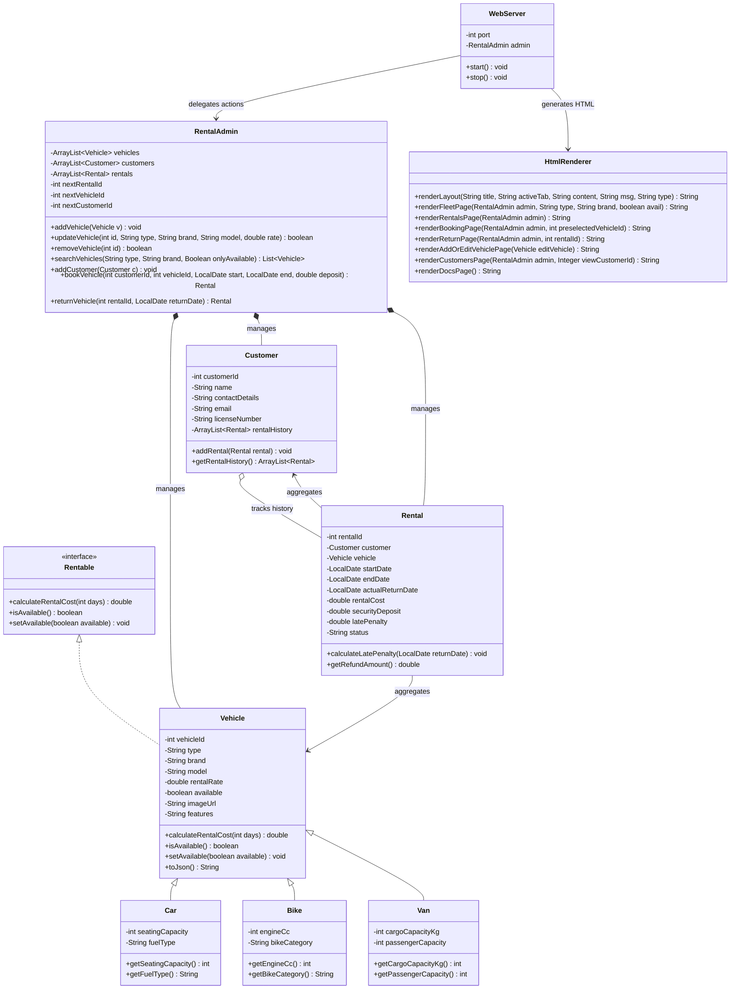
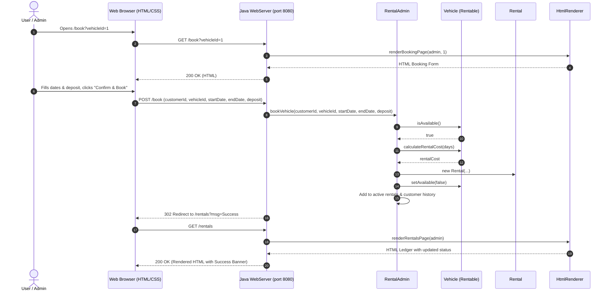
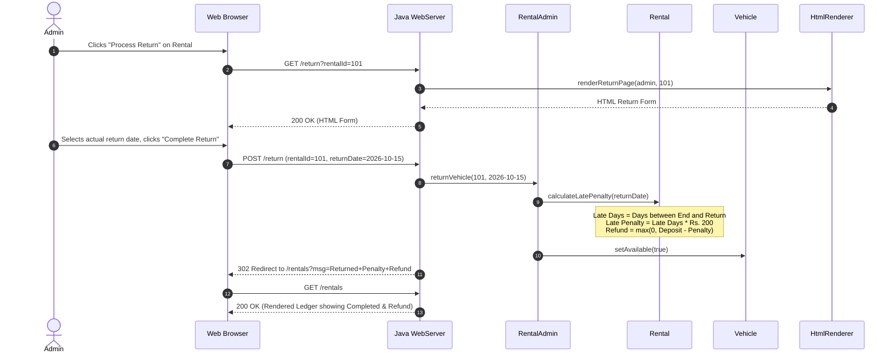

# 📄 Vehicle Rental System — OOP Design Document

## 1. System Overview
The **Vehicle Rental System** is a pure Object-Oriented Java application equipped with a server-side rendered (SSR) web interface built using **Java, HTML5, and CSS3** (100% pure Java backend; **Zero JavaScript / no other programming language used**). It manages vehicle fleet inventory, customer registrations, booking transactions, rental rate calculations, security deposit escrows, and late-return penalty settlements.

---

## 2. Object-Oriented Programming (OOP) Principles

| OOP Principle | Implementation in System |
| :--- | :--- |
| **Interface Implementation** | `Rentable` interface defines contract methods (`calculateRentalCost()`, `isAvailable()`, `setAvailable()`) implemented by `Vehicle`. |
| **Inheritance** | `Car`, `Bike`, and `Van` inherit common properties and behaviors from `Vehicle`. |
| **Polymorphism** | Runtime polymorphic handling of vehicles via `Rentable` references and specialized vehicle subtypes with distinct attributes. |
| **Encapsulation** | All entity fields are `private`, accessed and mutated via validated getter and setter methods. |
| **Composition & Aggregation** | `Rental` aggregates a `Customer` and a `Vehicle`. `RentalAdmin` manages collections of `Vehicle`, `Customer`, and `Rental` objects. |
| **Server-Side Rendering (SSR)** | `HtmlRenderer` dynamically renders HTML views using Java string builders styled with CSS3. |

---

## 3. Class Design & Architecture

---

## 4. Sequence Diagrams

### 4.1 Vehicle Booking Flow (Pure Java & HTML Form)

### 4.2 Vehicle Return & Penalty Settlement Flow

---

## 5. Mathematical & Business Formulas
1. **Rental Duration:**
   $$\text{Duration (days)} = \max(1, \text{ChronoUnit.DAYS.between}(\text{StartDate}, \text{EndDate}))$$
2. **Rental Cost:**
   $$\text{Rental Cost} = \text{Daily Rate} \times \text{Duration (days)}$$
3. **Late Days:**
   $$\text{Late Days} = \begin{cases} 
   \text{ChronoUnit.DAYS.between}(\text{EndDate}, \text{ReturnDate}) & \text{if } \text{ReturnDate} > \text{EndDate} \\ 
   0 & \text{otherwise} 
   \end{cases}$$
4. **Late Return Penalty:**
   $$\text{Late Penalty} = \text{Late Days} \times \text{Rs. } 200$$
5. **Security Deposit Refund:**
   $$\text{Refund Amount} = \max(0, \text{Security Deposit} - \text{Late Penalty})$$
